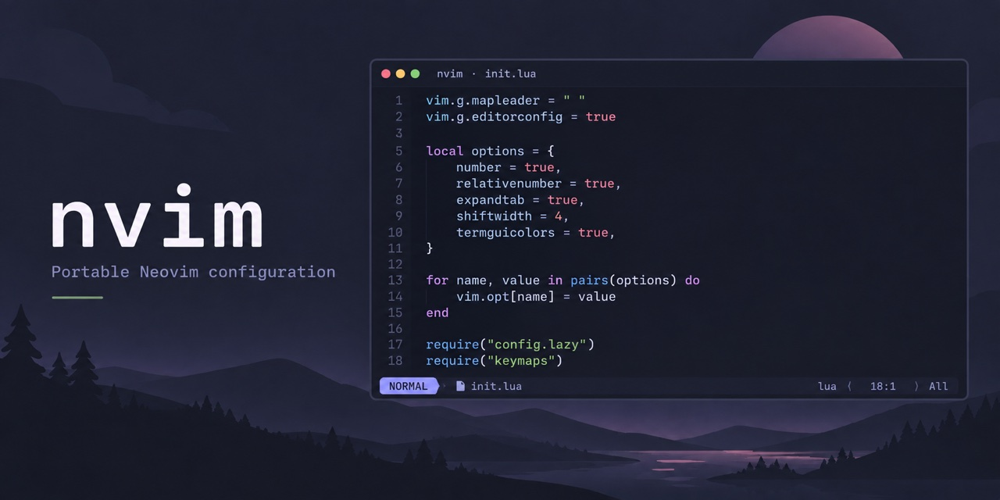

# Neovim configuration with Telescope, Tree-sitter, and Catppuccin



A portable, Lua-based Neovim configuration with automatic plugin installation,
pinned revisions, project-aware editing, and an Obsidian knowledge base. Clone
it, start Neovim, and `lazy.nvim` installs the configured plugins on first
launch.

**Tested only on macOS 27.0 (build 26A428) with Neovim 0.12.5.** Other
operating systems have not been tested.

## What is included

- **Find and navigate:** Telescope file, buffer, help, and project text search;
  a reusable built-in `netrw` file browser.
- **Edit code and markup:** Tree-sitter highlighting with parsers installed as
  needed, bracket pairing, and paired tag insertion and renaming for supported
  markup languages.
- **Keep project formatting:** built-in EditorConfig support and filetype-aware
  indentation. Project `.editorconfig` rules take precedence.
- **See useful context:** Catppuccin colors, a responsive lualine statusline,
  and macOS light/dark appearance synchronization.
- **Reproduce the setup:** plugin revisions are recorded in
  [`lazy-lock.json`](lazy-lock.json); configuration and maintenance notes live
  in the [Obsidian knowledge base](Neovim%20Knowlage/Home.md).

## Requirements

- Neovim 0.12.5 or a compatible newer stable release, and Git 2.19 or newer.
- A C compiler, `curl`, `tar`, and `tree-sitter-cli` 0.26.1 or newer for
  Tree-sitter parser installation.
- `rg` (ripgrep) for Telescope project text search.
- Network access on first launch to download plugins, and when installing a
  missing language parser.

On macOS, `brew install tree-sitter-cli ripgrep` installs the two command-line
tools; Apple developer tools provide a C compiler.

## Install

Clone into Neovim's configuration directory, then launch it:

```sh
git clone https://github.com/hardcodd/nvim.git "${XDG_CONFIG_HOME:-$HOME/.config}/nvim"
nvim
```

Use `Space f f` to find files, `Space f g` to search project text, and
`Space e` to open the file browser. The full list is in
[Key mappings](Neovim%20Knowlage/Keymaps.md).

For first-launch checks, parser maintenance, and troubleshooting, read the
[operations guide](Neovim%20Knowlage/Operations.md). The knowledge base also
documents the [architecture](Neovim%20Knowlage/Architecture.md),
[plugins](Neovim%20Knowlage/Plugins.md), and
[appearance](Neovim%20Knowlage/Appearance.md).

## License

Released under the [MIT License](LICENSE).
